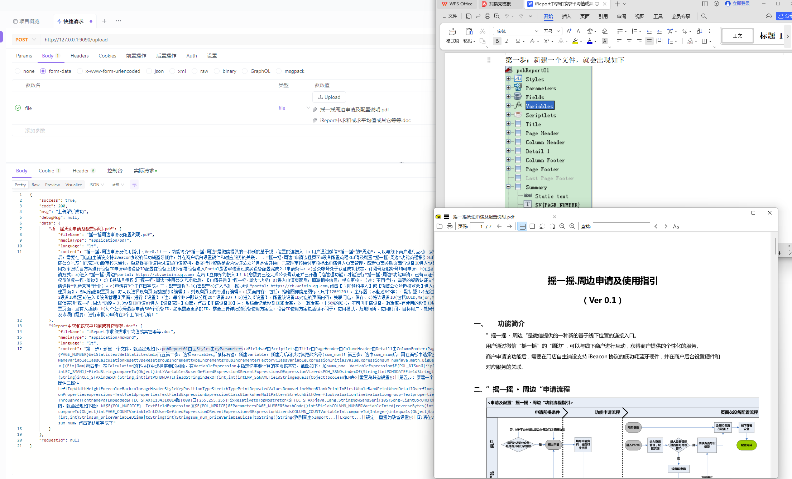

# tika-server

## 前言

简单的 tika 学习项目，主要实现了上传文档文件返回文档内容

## 项目结构

```
tika-server
 ├── tika-server-core                                                                            核心包
 │   └── src
 │       ├── main
 │       │   ├── java
 │       │   │   └── cn
 │       │   │       └── nn200433
 │       │   │           └── tika
 │       │   │               ├── config
 │       │   │               │   ├── TikaAutoConfig.java                                         注入配置
 │       │   │               │   └── TikaProperties.java                                         配置参数
 │       │   │               ├── entity
 │       │   │               │   ├── ThreadProperties.java                                       线程池配置
 │       │   │               │   └── ToolsPathProperties.java                                    第三方插件路径配置（如：tesseract-ocr、ffmpeg）
 │       │   │               ├── listener
 │       │   │               │   └── InitListener.java                                           项目启动完成监听器
 │       │   │               ├── service
 │       │   │               │   ├── DefineParser.java                                           文档解析器定义
 │       │   │               │   └── impl
 │       │   │               │       └── DefaultDefineParserImpl.java                            默认文档解析器实现
 │       │   │               └── utils
 │       │   │                   └── TikaUtil.java                                               主要的 tika 工具类
 │       │   └── resources                                                                       SpringbBoot SPI
 │       │       └── META-INF
 │       │           ├── org.springframework.boot.autoconfigure.AutoConfiguration.imports
 │       │           └── spring.factories
 │       └── test
 ├── tika-server-launcher
 │   └── src
 │       ├── main
 │       │   ├── java
 │       │   │   └── cn
 │       │   │       └── nn200433
 │       │   │           ├── tika
 │       │   │           │   ├── common
 │       │   │           │   │   └── Result.java                                                 统一响应对象
 │       │   │           │   ├── config
 │       │   │           │   │   └── ExceptionConfig.java                                        统一异常捕获配置
 │       │   │           │   ├── controller                                                      控制层（API 接口）
 │       │   │           │   │   └── IndexController.java
 │       │   │           │   ├── enums                                                           枚举定义
 │       │   │           │   │   ├── BaseEnum.java
 │       │   │           │   │   └── ResponseEnum.java
 │       │   │           │   ├── exception                                                       自定义异常
 │       │   │           │   │   └── ApiException.java
 │       │   │           │   └── service
 │       │   │           │       ├── AttachmentService.java                                      文件上传服务
 │       │   │           │       └── impl
 │       │   │           │           └── AttachmentServiceImpl.java
 │       │   │           └── TikaApiApplication.java                                             启动器
 │       │   └── resources
 │       │       ├── application.yml
 │       │       └── log4j2.xml
 │       └── test
 └── tika-server-ocr                                                                             其他 ocr 待实现
```

## 快速开始

### 辅助插件安装

> 这里的辅助插件为 图像处理 、 音视频处理 等第三方插件。（即需要命令行调用，Java 不好实现的）

1. [Tesseract-OCR 安装](doc/install/Tesseract-OCR 安装.md)
2. [ImageMagick 安装](doc/install/ImageMagick 安装.md)

### 配置

```yaml
server:
  port: 9090
tika:
  thread:
    # 线程名称
    name: tika
    # 核心线程数
    core-pool-size: 5
    # 最大线程数
    max-pool-size: 10
    # 队列容量
    queue-capacity: 20
    # 线程活跃时间（秒）
    keep-alive-seconds: 60
  tools-path:
    # ocr识别插件安装路径
    tess-ocr: E:\Program Files\Tesseract-OCR
    # 图像处理插件安装路径
    image-magick: E:\Program Files\ImageMagick-7.1.1-Q16-HDRI
```

### 开发

#### 环境

* jdk 1.8.0_341
* Apache Maven 3.9.4
* IntelliJ IDEA 2023.2.1
* Windows 11

#### 打包

项目根目录执行：

```bash
mvn clean install -Dmaven.test.skip=true
```

### 演示



## 特别鸣谢

> 感谢以下主要项目（还有一些未列出的，也十分感谢！），排名不分先后。

* [Hutool](https://hutool.cn) 是一个Java工具包，让Java语言也可以“甜甜的”。
* [Apache Tika](https://github.com/apache/tika) 是一个开源的 Java 库和工具，用于从各种文档类型中提取文本内容和元数据。
* [simplemagic](https://github.com/j256/simplemagic) 是一个简单的文件幻数和内容类型库，可从文件和字节数组进行 MIME 类型确定。
* [Tesseract](https://github.com/tesseract-ocr/tesseract) 是一个开源的光学字符识别（OCR）引擎，由 Google 开发和维护。它的主要功能是将图像或扫描的文档中的文字内容识别为可编辑的文本。Tesseract 可以处理多种语言和文本格式，并且在 OCR 领域有着广泛的应用。
* [ImageMagick](https://github.com/ImageMagick/ImageMagick) 是一套功能强大、稳定而且开源的工具集和开发包，可以用来读、写和处理超过 89 种基本格式的图片文件。
