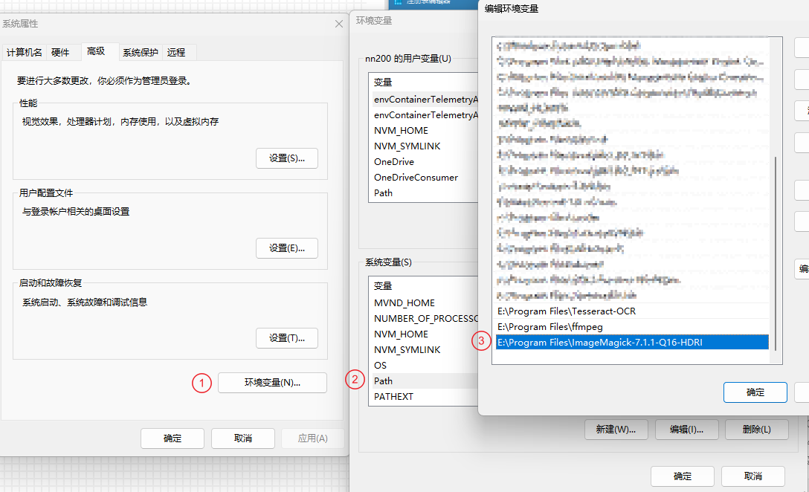

# ImageMagick

## 介绍

[ImageMagick](https://github.com/ImageMagick/ImageMagick) 是一套功能强大、稳定而且开源的工具集和开发包，可以用来读、写和处理超过 89 种基本格式的图片文件。包括流行的 TIFF、JPEG、GIF、 PNG、PDF 以及 PhotoCD 等格式。利用 ImageMagick，你可以根据 web 应用程序的需要动态生成图片, 还可以对一个 (或一组) 图片进行改变大小、旋转、锐化、减色或增加特效等操作，并将操作的结果以相同格式或其它格式保存，对图片的操作，即可以通过命令行进行，也可以用 C/C++、Perl、Java、PHP、Python 或 Ruby 编程来完成。同时 ImageMagick 提供了一个高质量的 2D 工具包，部分支持 SVG。ImageMagic 的主要精力集中在性能，减少 bug 以及提供稳定的 API 和 ABI 上。

## 使用

### 安装

#### Windows

1. 去官网下载安装包（[Windows 程序，点此前往](https://imagemagick.org/script/download.php#windows)）并安装程序。
   
2. 默认情况下安装路径为 `C:\Program Files\ImageMagick-7.0.7-Q16` ，在该路径下应该存在一个 convert.exe（旧版，有可能会有多个同名程序，导致冲突。参考 [Windows 系统安装及初步使用 ImageMagick](https://blog.csdn.net/qq_37674858/article/details/80361860) ），新版已经改为 `magick.exe` 应用程序。
3. 修改环境变量
   
4. 如果安装正常的话，执行 `magick -version` 将会输出版本信息
    ```bash
    C:\Users\xx>magick -version
    Version: ImageMagick 7.1.1-19 Q16-HDRI x64 99da019:20230930 https://imagemagick.org
    Copyright: (C) 1999 ImageMagick Studio LLC
    License: https://imagemagick.org/script/license.php
    Features: Channel-masks(64-bit) Cipher DPC HDRI Modules OpenCL OpenMP(2.0)
    Delegates (built-in): bzlib cairo flif freetype gslib heic jng jp2 jpeg jxl lcms lqr lzma openexr pangocairo png ps raqm raw rsvg tiff webp xml zip zlib
    Compiler: Visual Studio 2022 (193532217)
    ```