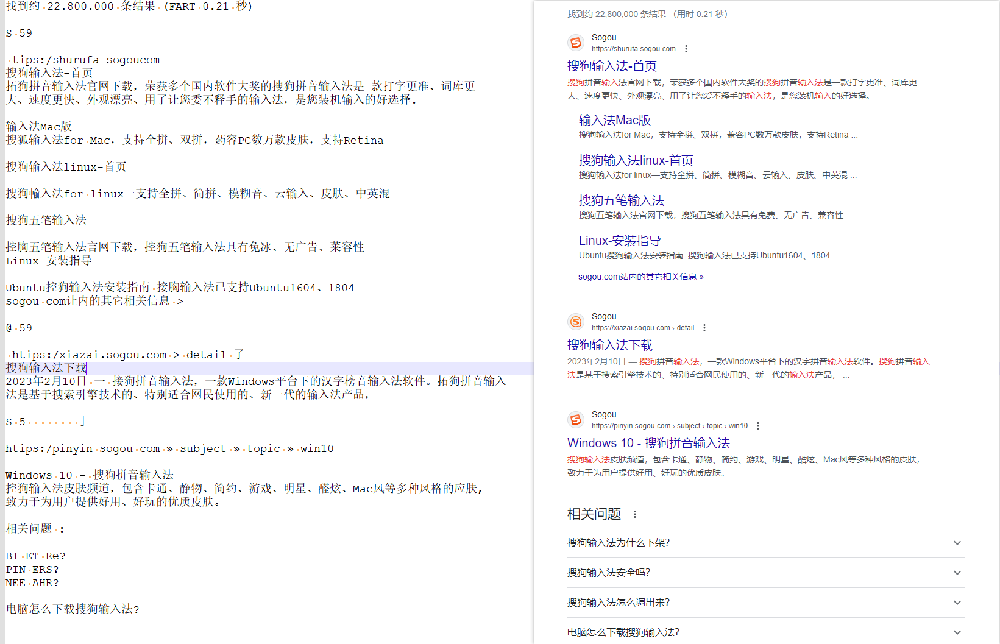

# Tesseract-OCR

## 介绍

[Tesseract](https://github.com/tesseract-ocr/tesseract) 是一个开源的光学字符识别（OCR）引擎，由 Google 开发和维护。它的主要功能是将图像或扫描的文档中的文字内容识别为可编辑的文本。Tesseract 可以处理多种语言和文本格式，并且在 OCR 领域有着广泛的应用。

以下是关于 Tesseract 的一些重要信息和特点：

1. 开源： Tesseract 是一个开源项目，可以免费使用和修改。它的源代码可在 GitHub 上获得，并得到了全球开发者社区的贡献和支持。
2. 多语言支持： Tesseract 支持超过 100 种语言的文本识别，包括许多主要的国际语言。这使其成为一个全球化的 OCR 引擎。
3. 图像处理： Tesseract 可以处理各种格式的图像，包括扫描文档、照片、图形文件等。它可以自动检测和调整图像的分辨率、角度、倾斜和对比度，以提高识别准确性。
4. 文本输出： Tesseract 会将识别的文本输出为可编辑的文本文件，通常是文本文件或 HTML 文件。这使得用户可以编辑和进一步处理识别的文本数据。
5. 训练和定制： Tesseract 允许用户根据特定的识别需求进行训练和定制。这对于处理非标准字体、特殊术语或特殊领域的文本非常有用。
6. 命令行工具和 API： Tesseract 提供了命令行工具和 API，允许开发人员集成 OCR 功能到他们的应用程序中。它支持多种编程语言，包括 Python、Java、C++ 等。

更多请参考官方文档

## 使用

### 安装

#### Windows

我们通常在 Debian GNU Linux 上运行 Tesseract，但也需要 Windows 版本。因此，我们开发了 Windows 版 Tesseract 安装程序。

警告：Tesseract 既可以安装在安装过程中建议的目录下，也可以安装在新的目录下。卸载程序会删除整个安装目录。如果将 Tesseract 安装在现有目录中，则该目录及其所有子目录和文件都将被删除。

最新安装程序可在此处下载：

* [tesseract-ocr-w64-setup-5.3.3.20231005.exe](https://digi.bib.uni-mannheim.de/tesseract/tesseract-ocr-w64-setup-5.3.3.20231005.exe) （64 位）

还有适用于 [32 位和 64 位 Windows](https://digi.bib.uni-mannheim.de/tesseract/) 的旧版本。

详细安装步骤如下：

1. 安装 Tesseract OCR 时需要勾选你需要的语言包（笔者一般全选），这样安装过程会自动下载模型

   
2. 并将安装后的 Tesseract-OCR 目录路径添加到环境变量 `PATH` 中，这样才能直接调用 `tesseract` 命令进行图片 OCR 提取文本

   
3. 如果安装正常的话，执行 `tesseract -v` 将会输出版本信息

    ```bash
    C:\Users\xx>tesseract -v
    tesseract v5.3.3.20231005
     leptonica-1.83.1
      libgif 5.2.1 : libjpeg 8d (libjpeg-turbo 2.1.4) : libpng 1.6.40 : libtiff 4.6.0 : zlib 1.2.13 : libwebp 1.3.2 : libopenjp2 2.5.0
     Found AVX2
     Found AVX
     Found FMA
     Found SSE4.1
     Found libarchive 3.7.2 zlib/1.3 liblzma/5.4.4 bz2lib/1.0.8 liblz4/1.9.4 libzstd/1.5.5
     Found libcurl/8.3.0 Schannel zlib/1.3 brotli/1.1.0 zstd/1.5.5 libidn2/2.3.4 libpsl/0.21.2 (+libidn2/2.3.3) libssh2/1.11.0
    ```

### 命令参数

```bash
C:\Users\xx>tesseract --help-extra
Usage:
  tesseract --help | --help-extra | --help-psm | --help-oem | --version
  tesseract --list-langs [--tessdata-dir PATH]
  tesseract --print-fonts-table [options...] [configfile...]
  tesseract --print-parameters [options...] [configfile...]
  tesseract imagename|imagelist|stdin outputbase|stdout [options...] [configfile...]

IN/OUT Arguments:
  FILE(imagename|imagelist|stdin)  输入文件的名称。这可以是图像文件或文本文件。
                                   支持大多数图像文件格式（Leptonica 可读取的任何格式）。
                                   文本文件列出所有输入图像的名称（每行一个图像名称）。每种输出文件格式（txt、pdf、hocr、xml）的结果都将合并到一个文件中。
                                   如果是 stdin 或 - ，则使用标准输入。
  OUTPUTBASE(outputbase|stdout)    输出文件的基本名称（将附加适当的扩展名）。默认情况下，输出将是一个文本文件，其基本名称中添加有 .txt，除非设置了一个或多个参数来明确指定所需的输出。
                                   如果是 stdout 或 - ，则使用标准输出。

OCR options:
  --tessdata-dir PATH   指定 tessdata 路径的位置。
  --user-words PATH     指定用户单词文件的位置。
  --user-patterns PATH  指定用户模式文件的位置。
  --dpi VALUE           指定输入图像的分辨率 N（以 DPI 为单位）。 N 的典型值为 300。如果没有此选项，将从图像中包含的元数据中读取分辨率。如果图像不包含该信息，Tesseract 会尝试猜测它。
  --loglevel LEVEL      指定日志记录级别。LEVEL 可以是 ALL、TRACE、DEBUG、INFO、WARN、ERROR、FATAL 或 OFF。
  -l LANG[+LANG]        要使用的语言或脚本。如果未指定，则假定为 eng（英语）。可以指定多种语言，并用 ”+“ （加号）分隔。 Tesseract 使用 3 字符 ISO 639-2 语言代码（请参阅语言和脚本）。
  -c VAR=VALUE          将参数 CONFIGVAR 的值设置为 VALUE。允许使用多个 -c 参数。
  --psm NUM             指定页面分割方式参数（指定合适的切割布局能提高识别率）
  --oem NUM             指定 OCR 引擎模式
NOTE: 这些选项必须出现在任何配置文件之前。

页面分割模式（可选参数）:
  0    仅限方向和脚本检测 (OSD)。
  1    使用OSD自动分页。
  2    自动页面分割，但没有 OSD 或 OCR 。（未实现）
  3    全自动页面分割，但没有 OSD 。（默认）
  4    假设有一列大小可变的文本。
  5    假设有一个统一的垂直对齐文本块。
  6    假设只有一个统一的文本块。
  7    将图像视为单行文本。
  8    将图像视为一个单词。
  9    将图像视为圆圈中的一个单词。
 10    将图像视为单字符。
 11    文本稀疏。查找尽可能多的文本，顺序不限。
 12    带有 OSD 的稀疏文本。
 13    原始行。将图像视为单行文本，绕过 Tesseract 特有的黑客技术。

OCR 引擎模式（可选参数）:
  0    仅旧版引擎。
  1    仅神经网络 LSTM 引擎。
  2    旧版 + 神经网络 LSTM 引擎
  3    基于现有的可用引擎（默认值）

Single options:
  -h, --help            显示最少的帮助信息。
  --help-extra          显示进阶帮助信息。
  --help-psm            显示页面分割模式。
  --help-oem            显示 OCR 引擎模式。
  -v, --version         显示版本信息。
  --list-langs          列出 tesseract 引擎的可用语言。
  --print-fonts-table   列出 tesseract 字体表格。
  --print-parameters    列出 tesseract 参数。
```

### 演示

```bash
tesseract E:\1.png E:\ocr -l chi_sim+eng+jpn --psm 3

# 以下摘至 CoderBaby 的 《Tika结合Tesseract-OCR 实现光学汉字识别（简体、宋体的识别率百分之百）—附Java源码、测试数据和训练集下载地址 》
#
# 中文语言请选如下4个：
# chi_sim.traineddata（简体，仅对宋体而言，像素 >= 300 dpi：识别率高达100%，同时对英文及阿拉伯数字识别率高达90%以上）
# chi_sim_vert.traineddata（简体，竖排）
# chi_tra.traineddata（繁体）
# chi_tra_vert.traineddata（繁体，竖排）
#
# 经过测试得出如下结论：
# 1、对于宋体，白色背景，非倾斜等，像素大于等于 300 dpi（识别率100%）
# 2、英文和数字，识别率超过90%
# 3、特殊字符识别率不高
# 4、像素太低，识别率急剧下降
# 5、多种背景颜色变化，识别率极低
# 6、字体换成草书等，识别率大幅降低
# 7、电影屏幕字幕和网页截图识别率较低
# 8、扫描件如果字体太淡或太小，完全识别不出来
# 9、提高识别率，需要自己做训练集，工作量巨大的体力活（简体汉字最少 6753 个，混合一些复杂的，至少要 10000 个字符；不同字体要重新做，因为本质上是图形几何计算，国内科研院所和开源的做的不多）
```

